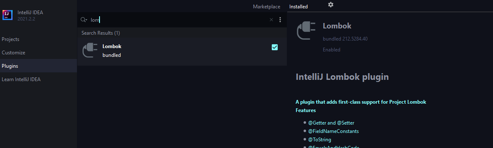
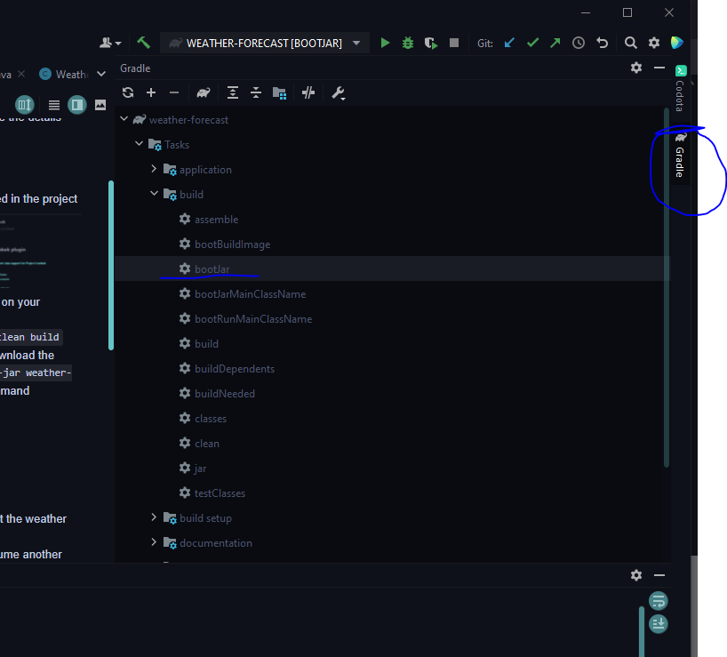
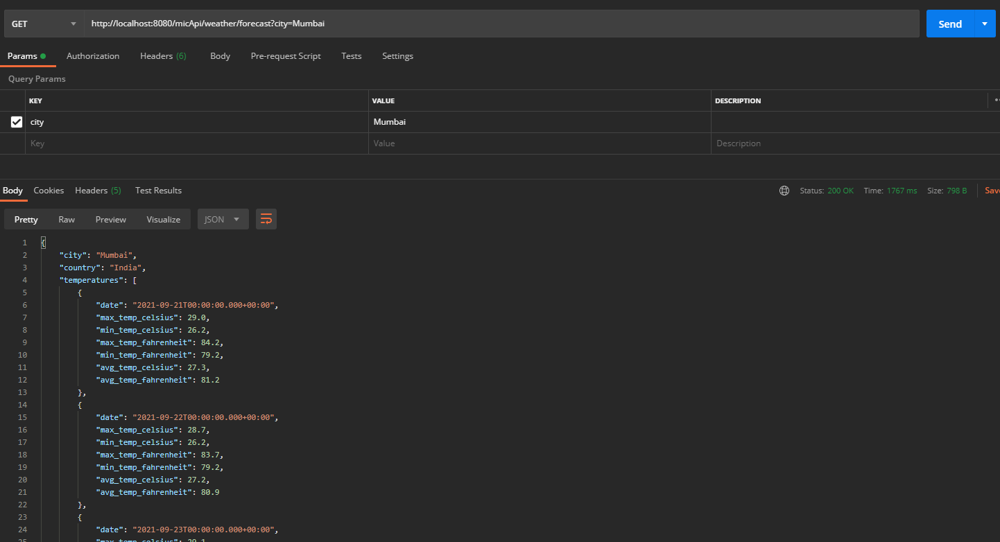
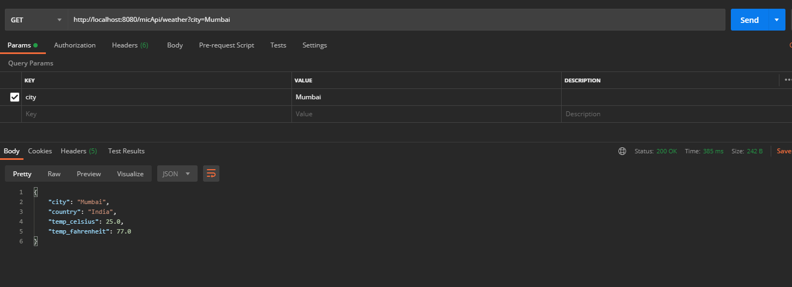

# WeatherApi_Consumer

Sample Application to communicate with microservices

API : https://www.weatherapi.com/docs/

Note: Change log level to 'DEBUG' to see the details logs

Requirement:

- Make sure 'Lombok' plugin is enabled in the project 
- Make sure gradle build is supported on your machine
- To build jar from Intellij you can follow this 
- To build jar use command `gradle clean build` (gradle is mandatory)
- If unable to build the jar than just download the [weather-forecast.jar](release/weather-forecast-0.0.1-SNAPSHOT.jar)
  and run `java -jar weather-forecast-0.0.1-SNAPSHOT.jar` command

Inputs :

- City Name

Overview :

- This hit's another api internally to get the weather data
- It is a demonstration of how to consume another microservice and handle the exceptions with proper status code

Note:

- We can change the number of forecast days by updating 'app.forecast.limit' property
  in [application.properties](src/main/resources/application.properties) currently it is set to 3
-

URL :

- Forecast : http://localhost:8080/micApi/weather/forecast?city=Mumbai 
- Current : http://localhost:8080/micApi/weather?city=Mumbai 
